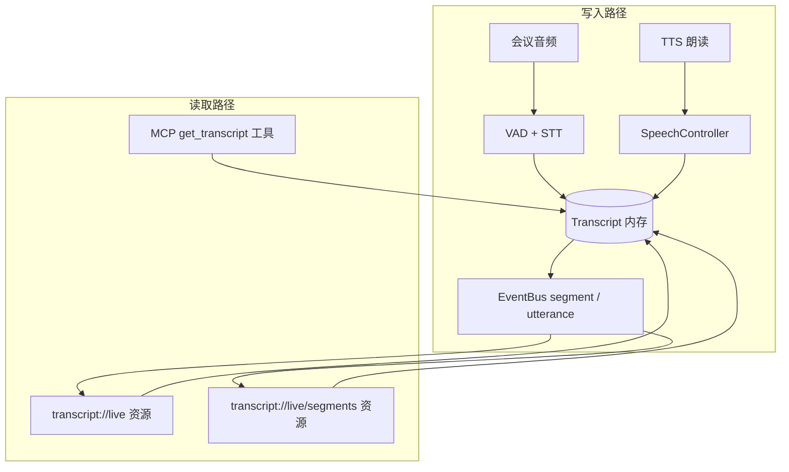

<p align="center">
  
</p>

<h1 align="center">让 AI 智能体加入你的会议 🤖</h1>

**joinly** 是一个连接中间件，使 AI 智能体能够加入并主动参与视频会议。通过 MCP 服务器，joinly 提供了必要的[会议工具](#工具)和[资源](#资源)，使任何 AI 智能体都能在实时会议中执行任务并与你交互。

> 想立即开始？跳到[快速开始](#快速开始)！

> [!IMPORTANT]  
> 不想折腾？试试我们的[云版本](https://cloud.joinly.ai)！☁️🚀

# ✨ 功能特性

- **实时交互**：智能体通过语音或聊天在会议中实时执行任务并回复
- **自然对话流**：内置逻辑处理中断和多人交互
- **跨平台支持**：支持 Google Meet、飞书、Zoom、Teams 等（或任何浏览器可访问的会议）
- **自带你的 LLM**：支持所有 LLM 提供商（也支持本地 Ollama）
- **灵活的 TTS/STT**：支持多种服务 - Whisper/Deepgram 用于 STT，Kokoro/ElevenLabs/Deepgram 用于 TTS
- **100% 开源、自托管、隐私优先** :rocket:

# ⚡ 快速开始

通过 Docker 运行 joinly，配合对话 AI 客户端。

## 系统要求

> [!IMPORTANT]
> **必须安装**：
>
> - [Docker Desktop](https://docs.docker.com/engine/install/) （包含 Docker 引擎）
> - **至少 50GB 磁盘空间**（镜像 ~2.3GB + ML 模型 ~2GB + 工作目录）
> - **网络**：能访问 GitHub、PyPI、模型仓库（如需翻墙，请提前开启 VPN）

### 针对飞书用户的额外要求

如果你想使用**飞书**（vc.feishu.cn）：

- **CPU 架构**：需要构建 AMD64 镜像（包含 Google Chrome）
- **Python 版本**：镜像内固定使用 **Python 3.12**（由 `ENV UV_PYTHON=3.12` 控制）。`onnxruntime==1.21.1` 仅提供 cp312/cp313 wheel，**不支持 Python 3.13+**，请勿随意升级
- **构建环境**：
  - Docker 必须支持多平台构建（`docker build --platform linux/amd64`）
  - 在 Apple Silicon Mac 上，Docker Desktop 会自动用 Rosetta 模拟 AMD64
  - **构建时间**：首次构建 30-60 分钟（下载 Ubuntu、Chrome、Python 3.12、ML 模型）
  - **网络稳定**：Chrome 下载来自 Google，建议全程开启 VPN

## 步骤 1：创建 .env 文件

在项目根目录创建 `.env` 文件，填入你的 LLM 配置（以 OpenAI 为例）：

```dotenv
# .env 示例
JOINLY_LLM_MODEL=gpt-4o
JOINLY_LLM_PROVIDER=openai
OPENAI_API_KEY=your-openai-api-key
JOINLY_NAME=Joinly AI
```

> [!TIP]
>
> - OpenAI API 密钥：https://platform.openai.com/api-keys
> - 完整配置选项见 [.env.example](.env.example)（包括 Claude、Ollama 等）

## 步骤 2：启动容器

**Google Meet 或 Zoom（使用官方镜像，推荐新手）：**

```bash
docker run --env-file .env \
  ghcr.io/joinly-ai/joinly:latest \
  --client "<MeetingURL>"
```

**飞书（需要本地构建镜像）：**

首先构建镜像（**第一次需要 30-60 分钟**，请确保 VPN 已开启）：

```bash
docker build --platform linux/amd64 -t joinly-feishu .
```

**后续只改代码时**（不改依赖），用以下命令快速重建，Docker 会复用缓存、不重新下载任何东西：

```bash
docker build --platform linux/amd64 --cache-from joinly-feishu:latest -t joinly-feishu:latest .
```

然后运行（见下方[飞书支持](#飞书-飞书-支持)章节）。

> :red_circle: 遇到问题？加我们的 [Discord](https://discord.com/invite/AN5NEBkS4d)!

# 🐦 飞书（飞书）支持

本项目添加了对**飞书** 视频会议（`vc.feishu.cn`）的支持。

> [!IMPORTANT]
> 飞书需要预认证的浏览器会话才能通过网页加入会议。你需要导出一次飞书登录 Cookie 并提供给容器。

## 前置条件

本仓库需要从源码构建镜像（官方 `joinly-ai/joinly` 镜像不支持飞书）：

```bash
docker build --platform linux/amd64 -t joinly-feishu .
```

> **说明**：`--platform linux/amd64` 标志是必需的，以安装 Google Chrome（用于通过飞书的浏览器检测）。在 Apple Silicon Mac 上，Docker 会通过 Rosetta 模拟 AMD64 运行。

**后续只改代码时**（不改依赖），用以下命令快速重建，Docker 会复用缓存、不重新下载任何东西：

```bash
docker build --platform linux/amd64 --cache-from joinly-feishu:latest -t joinly-feishu:latest .
```

## 步骤 1：导出飞书 Cookie

**第一步：安装 Cookie-Editor 扩展**

在 Google Chrome 中打开以下链接，安装扩展：

```
https://chromewebstore.google.com/detail/cookie-editor/hlkenndednhfkekhgcdicdfddnkalmdm
```

**第二步：登录飞书网页版**

在 Chrome 中打开：

```
https://vc.feishu.cn
```

用手机号 + 短信验证码登录飞书账号，登录成功后页面会显示"发起新会议 / 加入会议"。

**第三步：导出 Cookie**

1. 保持在 `vc.feishu.cn` 页面，点击浏览器右上角的 **Cookie-Editor 扩展图标**（如果没有，点击拼图图标在扩展列表中找到它）
2. 扩展面板打开后，点击底部的 **Export** 按钮
3. 选择 **Export as JSON**
4. 此时 JSON 内容已复制到剪贴板

**第四步：保存文件**

在项目根目录新建文件 `feishu_cookies.json`，将剪贴板内容粘贴进去并保存：

```
joinly/
├── feishu_cookies.json   ← 新建这个文件，粘贴 Cookie 内容
├── .env
├── Dockerfile
└── ...
```

> [!WARNING]
> `feishu_cookies.json` 包含你的飞书登录令牌。**绝不要提交到公开仓库**。该文件已列入 `.gitignore`。

## 步骤 2：运行（带 Cookie）

> [!IMPORTANT]
> 必须在**项目根目录**下执行以下命令，否则 `.env` 和 `feishu_cookies.json` 路径找不到。

```bash
cd /path/to/joinly   # 先进入项目根目录
```

然后启动容器：

```bash
docker run -d \
  --name joinly-feishu \
  --env-file .env \
  -e JOINLY_FEISHU_COOKIES_FILE=/cookies/feishu_cookies.json \
  -v $(pwd)/feishu_cookies.json:/cookies/feishu_cookies.json:ro \
  joinly-feishu \
  --client "https://vc.feishu.cn/j/<会议ID>"
```

参数说明：

- `-d`：后台运行，终端不会被阻塞
- `--name joinly-feishu`：指定容器名称，便于后续管理（不加则随机命名）
- `--env-file .env`：加载配置文件（必须在项目目录下执行）
- `-v $(pwd)/feishu_cookies.json:...`：将本地 Cookie 文件挂载进容器

**查看运行日志：**

```bash
docker logs -f joinly-feishu
```

**停止容器：**

```bash
docker stop joinly-feishu && docker rm joinly-feishu
```

Bot 加入会议后会自动：

1. 访问会议链接
2. 点击**网页版入会**
3. 填入显示名称（来自 `.env` 的 `JOINLY_NAME`）
4. 点击**加入**进入会议

## Cookie 过期

飞书登录会话会在一段时间不活动后过期。如果 Bot 无法加入（卡在登录页），请重新导出 Cookie 并替换 `feishu_cookies.json`。

## 飞书会议接入坑点速查

修改 `joinly/providers/browser/platforms/feishu.py` 时务必注意以下已踩过的坑：

### 1. Landing page「Join On This Browser」按钮（必须用 class 精准匹配）

飞书 landing page 的入会区域 HTML 结构是：

```html
<div class="btn-container">
  <button class="...download-btn">Download Feishu</button>
  <button class="...join-meeting">Join On This Browser</button>
</div>
```

**坑**：父容器 `<div class="btn-container">` 的 `textContent` 是两个按钮文本拼接（`"Download FeishuJoin On This Browser"`），如果用 `textContent.includes("Join On This Browser")` 匹配父容器再 `.click()`，会点不中目标按钮。

**解法**：直接 `document.querySelectorAll('button.join-meeting')` 精准点击子按钮，绕开父容器。

### 2. React 组件不挂 `onclick` 属性

飞书是 React 应用，所有点击事件挂在 React fiber 上，**不会**写入 DOM 的 `onclick` 属性。所以：

- ❌ `document.querySelectorAll('div[onclick], span[onclick]')` 永远查不到 React 按钮
- ✅ 应该用类名（如 `button.join-meeting`、`button.kes3qNGU`）或 SVG 图标（如 `svg[data-icon="MicOffFilled"]`）定位

### 3. 加入弹窗是异步渲染的

`page.goto(url)` 后即使 `networkidle` 已经触发，会议加入弹窗可能仍在 React 异步渲染。直接查 DOM 找不到「在浏览器中加入」按钮。

**解法**：用 `page.wait_for_function(..., arg=pattern, timeout=20000)` 显式等待按钮文字出现（注意 `arg` 必须是关键字参数，不是位置参数）。

### 4. Playwright 可见性检查会卡住自动隐藏的工具栏

飞书会议室的底部工具栏（麦克风、聊天、表情等按钮）会自动隐藏，导致 Playwright `is_visible()` / `click()` 报"element not visible"。

**解法**：所有工具栏按钮一律用 `page.evaluate()` 中的 JS 点击，配合 `getBoundingClientRect()` 自己判断可见性，绕开 Playwright 的稳定性检查。

### 5. lark-editor 富文本输入框

飞书聊天框是 `<pre class="lark-editor" contenteditable>`（ProseMirror 风格），不是普通 textarea：

- ❌ `chat_input.fill(text)` / `press_sequentially(text)` — 不触发 composition events，编辑器不识别
- ✅ `page.keyboard.insert_text(text)` — IME 风格输入
- ✅ 发送：先用 `chat_input.press("Enter")`，失败则 JS `dispatchEvent(new KeyboardEvent('keydown', {key:'Enter', ...}))` 兜底

### 6. 已登录用户跳过 join 表单

带有效 cookie 的用户点击「在浏览器中加入」后，可能直接进入会议室，跳过填名字 + 点 Join 的表单。

**解法**：跳转后先用 `_check_joined(page, timeout=3)` 短超时检查是否已经在会议中，是则提前 return，避免后续 `wait_for join button enabled` 卡 30 秒超时报错。

### 7. 不同会议 ID 可能走不同 landing page

不同的会议 ID 渲染的 landing page DOM 可能不同：有的直接显示「在浏览器中加入」，有的先显示首页 + Modal，有的需要更长加载时间。**改动后请用多个会议 ID 实测验证**，不要只测一个就以为通用。

### 8. 静音状态下 TTS 回声阻塞 STT

bot 调用 `mute_yourself` 后，Feishu UI 静音只是告诉会议"不广播我的麦克风"，但 TTS 音频仍通过 PulseAudio 虚拟麦克风静默播放。在此期间 `tts_active_event` 持续为 set，若 STT 逻辑在 `tts_active_event` 期间跳过所有语音窗口，用户说话就无法被转写。

**解法**：在 `MeetingSession` 中用 `_is_muted` 标志追踪静音状态，`speak_text` 检测到静音时直接跳过 TTS 播放，仅发送聊天消息，`tts_active_event` 不会被置位，STT 完全不受影响。

---

## 阿里云 STT / TTS 接入说明

本项目已集成阿里云 NLS（自然语言服务）作为中文 STT 和 TTS 方案，相比本地 Whisper 模型延迟从 30-80s 降至约 0.3-0.5s。

### STT（语音识别）— AliyunSTT

**协议**：WebSocket（`wss://nls-gateway.cn-shanghai.aliyuncs.com/ws/v1`）

**流程**：
```
获取 Token（HMAC-SHA1 签名） → WS 连接 → StartTranscription
→ 持续发送 PCM 音频帧 → 等待 SentenceEnd 事件
→ 发送 StopTranscription → TranscriptionCompleted → 断开
```

**关键实现细节**：
- Token 获取用阿里云 RPC V1 签名（`GET&%2F&<编码后参数>`），参数必须手动拼接 `&`，**不能用 `urlencode`**（会对 `%3A` 二次编码变成 `%253A`，签名不匹配）
- 每个 `SpeechWindow`（VAD 切割的语音片段）对应一个 WS 会话，会话粒度为一句话
- 启用 `enable_punctuation_prediction` 和 `enable_inverse_text_normalization` 提升中文质量

**配置**：
```dotenv
JOINLY_STT=aliyun
ALIYUN_ACCESS_KEY_ID=<your_key>
ALIYUN_ACCESS_KEY_SECRET=<your_secret>
ALIYUN_NLS_APP_KEY=<your_appkey>
```

### TTS（语音合成）— AliyunTTS

**协议**：REST API（`POST https://nls-gateway.cn-shanghai.aliyuncs.com/stream/v1/tts`）

> 注意：WebSocket `SpeechSynthesizer` 协议同样可用，但 `FlowingSpeechSynthesizer`（大模型音色如 `longxiaochun`）是另一套命令集，两套**不能混用**。REST 接口最稳定，适合一次性合成完整文本。

**流程**：
```
POST JSON（含 text、voice、format、sample_rate） → 流式读取响应体 PCM 字节 → 送入虚拟麦克风
```

**音色与采样率约束**：
- 下游虚拟麦克风固定 **24000 Hz**，TTS 输出必须匹配，系统不做自动重采样
- `xiaoyun` 等基础音色仅支持 16000 Hz → **会导致 `IncompatibleAudioFormatError`**
- 推荐音色（支持 24000 Hz）：`aixia`（女，默认）、`sicheng`（男）、`sijia`（女）

**配置**：
```dotenv
JOINLY_TTS=aliyun
ALIYUN_ACCESS_KEY_ID=<your_key>
ALIYUN_ACCESS_KEY_SECRET=<your_secret>
ALIYUN_NLS_APP_KEY=<your_appkey>
# 可选：指定音色
# JOINLY_TTS_ARGS={"voice":"sicheng"}
```

### 标准调试命令

```bash
docker build --platform linux/amd64 -t joinly-feishu:latest .
docker stop joinly-feishu-container1 && docker rm joinly-feishu-container1
docker run -d --name joinly-feishu-container1 \
  --env-file .env \
  -v $(pwd)/feishu_cookies.json:/cookies/feishu_cookies.json:ro \
  joinly-feishu:latest \
  --client "https://vc.feishu.cn/j/<会议ID>"
docker logs -f joinly-feishu-container1

# 拷贝调试截图
docker cp joinly-feishu-container1:/tmp/feishu_step1.png ~/Desktop/
docker cp joinly-feishu-container1:/tmp/feishu_step2.png ~/Desktop/
```

---

# 👨‍💻 运行外部客户端

在快速开始中，我们直接以 `--client` 模式运行容器。你也可以把它作为服务器运行，从容器外部连接，这样就能接入其他 MCP 服务器。此处使用 [joinly-client 包](https://pypi.org/project/joinly-client/)运行客户端。

> [!IMPORTANT]
> **前置条件**：完成[快速开始](#快速开始)的准备步骤、[安装 uv](https://github.com/astral-sh/uv)、打开两个终端

在第一个终端启动 joinly 服务器（注意：不使用 `--client`，转发端口 `8000`）：

```bash
docker run -p 8000:8000 ghcr.io/joinly-ai/joinly:latest
```

在第二个终端运行客户端连接到服务器并加入会议：

```bash
uvx joinly-client --env-file .env <MeetingUrl>
```

## 为客户端添加 MCP 服务器

通过 JSON 配置为客户端添加任何 MCP 服务器的工具。配置文件可在 `"mcpServers"` 下包含多个条目，这些工具都将在会议中可用（见 [fastmcp 客户端文档](https://gofastmcp.com/clients/client)）：

```json
{
  "mcpServers": {
    "localServer": {
      "command": "npx",
      "args": ["-y", "package@0.1.0"]
    },
    "remoteServer": {
      "url": "http://mcp.example.com",
      "auth": "oauth"
    }
  }
}
```

例如添加 [Tavily 配置](examples/config_tavily.json)以进行网络搜索，然后使用配置文件运行客户端：

```bash
uvx joinly-client --env-file .env --mcp-config config.json <MeetingUrl>
```

# ⚙️ 配置选项

配置可通过环境变量和/或命令行参数指定。以下是启动 Docker 容器时常用的配置选项：

```bash
docker run --env-file .env -p 8000:8000 ghcr.io/joinly-ai/joinly:latest <MyOptionArgs>
```

或者，你可以在 `joinly-client` 中通过命令行参数传递 `--name`、`--lang` 和[提供商设置](#提供商)，这些会覆盖服务器设置：

```bash
uvx joinly-client <MyOptionArgs> <MeetingUrl>
```

## 基本设置

Docker 镜像默认启动 MCP 服务器。为快速上手，我们也提供了可通过 `--client` 使用的客户端实现。此时不启动服务器，其他客户端无法连接。

```bash
# 直接作为客户端启动；默认是服务器，外部客户端可连接
--client <MeetingUrl>

# 改变参与者名称（默认：joinly）
--name "AI Assistant"

# 改变 TTS/STT 语言（默认：en）
# 注：可用性取决于 TTS/STT 提供商
--lang zh-CN

# 改变 joinly MCP 服务器的主机和端口
--host 0.0.0.0 --port 8000
```

## Providers

### Text-to-Speech

```bash
# Kokoro (local) TTS (default)
--tts kokoro
--tts-arg voice=<VoiceName>  # optionally, set different voice

# ElevenLabs TTS, include ELEVENLABS_API_KEY in .env
--tts elevenlabs
--tts-arg voice_id=<VoiceID>  # optionally, set different voice

# Deepgram TTS, include DEEPGRAM_API_KEY in .env
--tts deepgram
--tts-arg model_name=<ModelName>  # optionally, set different model (voice)
```

### Transcription

```bash
# Whisper (local) STT (default)
--stt whisper
--stt-arg model_name=<ModelName>  # optionally, set different model (default: base), for GPU support see below

# Deepgram STT, include DEEPGRAM_API_KEY in .env
--stt deepgram
--stt-arg model_name=<ModelName>  # optionally, set different model
```

## Debugging

```bash
# Start browser with a VNC server for debugging;
# forward the port and connect to it using a VNC client
--vnc-server --vnc-server-port 5900

# Logging
-v  # or -vv, -vvv

# Help
--help
```

## GPU Support

We provide a Docker image with CUDA GPU support for running the transcription and TTS models on a GPU. To use it, you need to have the [NVIDIA Container Toolkit](https://docs.nvidia.com/datacenter/cloud-native/container-toolkit/latest/install-guide.html) installed and `CUDA >= 12.6`. Then pull the CUDA-enabled image:

```bash
docker pull ghcr.io/joinly-ai/joinly:latest-cuda
```

Run as client or server with the same commands as above, but use the `joinly:{version}-cuda` image and set `--gpus all`:

```bash
# Run as server
docker run --gpus all --env-file .env -p 8000:8000 ghcr.io/joinly-ai/joinly:latest-cuda -v
# Run as client
docker run --gpus all --env-file .env ghcr.io/joinly-ai/joinly:latest-cuda -v --client <MeetingURL>
```

By default, the `joinly` image uses the Whisper model `base` for transcription, since it still runs reasonably fast on CPU. For `cuda`, it automatically defaults to `distil-large-v3` for significantly better transcription quality. You can change the model by setting `--stt-arg model_name=<model_name>` (e.g., `--stt-arg model_name=large-v3`). However, only the respective default models are packaged in the docker image, so it will start to download the model weights on container start.

# :test_tube: Create your own agent

You can also write your own agent and connect it to our joinly MCP server. See the [code examples](https://github.com/joinly-ai/joinly/client/README.md#code-usage) for the joinly-client package or the [client_example.py](examples/client_example.py) if you want a starting point that doesn't depend on our framework.

The joinly MCP server provides following tools and resources:

### Tools

- **`join_meeting`** - Join meeting with URL, participant name, and optional passcode
- **`leave_meeting`** - Leave the current meeting
- **`speak_text`** - Speak text using TTS (requires `text` parameter)
- **`send_chat_message`** - Send chat message (requires `message` parameter)
- **`mute_yourself`** - Mute microphone
- **`unmute_yourself`** - Unmute microphone
- **`get_chat_history`** - Get current meeting chat history in JSON format
- **`get_participants`** - Get current meeting participants in JSON format
- **`get_transcript`** - Get current meeting transcript in JSON format, optionally filtered by minutes
- **`get_video_snapshot`** - Get an image from the current meeting, e.g., view a current screenshare

### 读取当前聊天历史（`get_chat_history`）流程

智能体或客户端调用 MCP 工具 **`get_chat_history`** 时，服务端按以下顺序执行（代码路径便于排查问题）：

1. **`joinly/server.py`**  
   MCP 工具 `get_chat_history` 从请求上下文取出 `MeetingSession`，调用 `await ms.get_chat_history()`。

2. **`joinly/session.py` → `MeetingSession.get_chat_history`**  
   在 `animation("reading")` 上下文中执行（摄像头/虚拟人展示「阅读」动画），再调用  
   `await self._meeting_provider.get_chat_history()`。

3. **`joinly/providers/browser/meeting_provider.py` → `BrowserMeetingProvider.get_chat_history`**  
   通过 `_action_guard("get_chat_history")` 串行占用 Playwright 页面，避免与入会、发消息等操作并发冲突；  
   根据会议 URL 解析出的平台控制器，调用  
   `await controller.get_chat_history(page)`。

4. **各平台 `joinly/providers/browser/platforms/*.py`**  
   由具体平台实现 DOM 抓取逻辑，返回 `MeetingChatHistory`（JSON 中为消息列表，含 `text`、`sender`、`timestamp` 等字段）：
   - **Google Meet**：打开侧边聊天面板，在 `aside[aria-label="Side panel"]` 内按 `data-message-id` 等选择器解析气泡。
   - **飞书**：先 `_open_chat` 打开聊天，再在 `.list_items` 内用 `[data-position]` 定位气泡，通过 `page.evaluate` 读取 `.egkYihyL`（发送者）、`.WO1jtrBH`（时间）、`.pJ07o4qa`（正文）。飞书使用虚拟滚动，**仅当前视区内已渲染的消息会被读到**；需要更多历史时应在产品内将聊天区滚动到底部后再调用工具。
   - **Zoom / Teams**：各自实现打开聊天区并解析消息列表。

5. **返回**  
   结构化结果经 MCP 以 JSON 返回给客户端；若某平台暂未实现或 DOM 变更导致解析为空，对应实现可能返回占位消息或空列表（以代码与日志为准）。


### 读取当前转写（transcript）流程

转写数据写在内存中的 **`Transcript`** 对象里（`joinly_common` 类型），由 **`DefaultTranscriptionController`** 在后台持续写入：会议音频 → `AudioReader` → VAD → STT → `transcript.add_segment(...)`，并通过 **`EventBus`** 发布 **`segment`**（每条片段）与 **`utterance`**（整句 STT 结束）事件。Agent 朗读经 TTS 写入同一份 transcript 时带 `SpeakerRole.assistant`。

**读取方式有三类（均为「读内存」，不访问浏览器 DOM）：**

1. **MCP 工具 `get_transcript`**（`joinly/server.py` → `get_transcript_tool`）  
   从 `MeetingSession.transcript` 取当前对象（须已 `join_meeting`，否则访问属性会报错）。  
   - `mode=full`（默认）：`ms.transcript.compact()`，完整转写做紧凑序列化。  
   - `mode=first` + `minutes`：会议开始后**前 N 分钟**内片段：`before(minutes * 60).compact()`。  
   - `mode=latest` + `minutes`：相对当前会议时长 **`meeting_seconds`** 的**最近 N 分钟**：`after(meeting_seconds - minutes * 60).compact()`。

2. **MCP 资源 `transcript://live`**（处理器 `get_transcript`）  
   `return ms.transcript.with_role(SpeakerRole.participant)`：仅保留**参会者侧**角色片段，常用于对外展示「人说了什么」、减少本机 Agent 话术重复。

3. **MCP 资源 `transcript://live/segments`**（处理器 `get_transcript_segments`）  
   `return ms.transcript`：**不做角色过滤**，包含所有已写入片段（含助手朗读等，视 STT/TTS 写入逻辑而定）。

**实时推送（订阅资源）：** 在 `session_lifespan` 中注册资源订阅：订阅 `transcript://live` 时监听 **`utterance`**（整句说完后刷新全文资源）；订阅 `transcript://live/segments` 时监听 **`segment`**（每条片段更新）。客户端订阅后会在对应事件触发时收到 `resources/updated` 通知。



### Resources

- **`transcript://live`** - 实时转写 JSON（**仅参会者角色** `with_role(participant)`）。可订阅：服务端在 **`utterance`** 事件（一句用户话 STT 跑完）时推送资源更新。
- **`transcript://live/segments`** - 实时转写片段 JSON（**全量片段**，不过滤角色）。可订阅：在 **`segment`** 事件（每条转写/朗读片段写入）时推送更新。
- **`usage://current`** - 各服务当前用量统计（JSON）。

# :building_construction: Developing joinly.ai

For development we recommend using the development container, which installs all necessary dependencies. To get started, install the DevContainer Extension for Visual Studio Code, open the repository and choose **Reopen in Container**.


The installation can take some time, since it downloads all packages as well as models for Whisper/Kokoro and the Chromium browser. At the end, it automatically invokes the [download_assets.py](scripts/download_assets.py) script. If you see errors like `Missing kokoro-v1.0.onnx`, run this script manually using:

```bash
uv run scripts/download_assets.py
```

We'd love to see what you are using it for or building with it. Showcase your work on our [discord](https://discord.com/invite/AN5NEBkS4d)

# :pencil2: Roadmap

**Meeting**

- [x] Meeting chat access
- [ ] Camera in video call with status updates
- [ ] Enable screen share during video conferences
- [ ] Participant metadata and joining/leaving
- [ ] Improve browser agent capabilities

**Conversation**

- [x] Speaker attribute for transcription
- [ ] Improve client memory: reduce token usage, allow persistence across meetings
      events
- [ ] Improve End-of-Utterance/turn-taking detection
- [ ] Human approval mechanism from inside the meeting

**Integrations**

- [ ] Showcase how to add agents using the A2A protocol
- [ ] Add more provider integrations (STT, TTS)
- [ ] Integrate meeting platform SDKs
- [ ] Add alternative open-source meeting provider
- [ ] Add support for Speech2Speech models

# :busts_in_silhouette: Contributing

Contributions are always welcome! Feel free to open issues for bugs or submit a feature request. We'll do our best to review all contributions promptly and help merge your changes.

Please check our [Roadmap](#pencil2-roadmap) and don't hesitate to reach out to us!

# :memo: License

This project is licensed under the MIT License ‒ see the [LICENSE](LICENSE) file for details.

# :speech_balloon: Getting help

If you have questions or feedback, or if you would like to chat with the maintainers or other community members, please use the following links:

- [Join our Discord](https://discord.com/invite/AN5NEBkS4d)
- [Explore our GitHub Discussions](https://github.com/joinly-ai/joinly/discussions)

<div align="center">
Made with ❤️ in Osnabrück
 </div>
