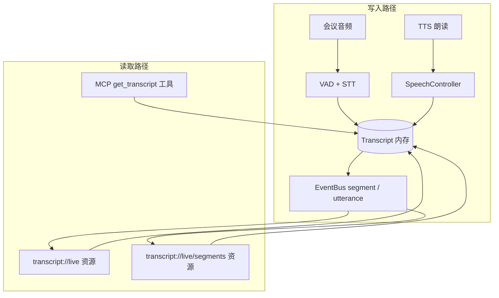

<p align="center">
  
</p>

<h1 align="center">让 AI 智能体加入你的会议 🤖</h1>

**joinly** 是一个连接中间件，使 AI 智能体能够加入并主动参与视频会议。通过 MCP 服务器，joinly 提供必要的会议工具与资源（详见 [§7 MCP 工具与资源](#七mcp-工具与资源)），任何 AI 智能体都能在实时会议中执行任务并与你交互。

> 想立即开始？macOS / Windows 用 Docker 见 [§3](#三macos--windows-docker-部署)，Linux 服务器原生部署见 [§4](#四linux-服务器原生部署不用-docker)。

---

## 📚 目录

1. [功能特性](#一功能特性)
2. [环境要求](#二环境要求)
3. [macOS / Windows Docker 部署](#三macos--windows-docker-部署)
4. [Linux 服务器原生部署（不用 Docker）](#四linux-服务器原生部署不用-docker)
5. [阿里云 STT / TTS](#五阿里云-stt--tts)
6. [运行作为独立 MCP 服务器](#六运行作为独立-mcp-服务器)
7. [MCP 工具与资源](#七mcp-工具与资源)
8. [配置选项](#八配置选项)
9. [飞书接入坑点速查](#九飞书接入坑点速查)
10. [开发与贡献](#十开发与贡献)

---

# 一、功能特性

- **实时交互**：智能体通过语音或聊天在会议中实时执行任务并回复
- **自然对话流**：内置 barge-in 打断与多人交互逻辑
- **跨平台支持**：Google Meet、飞书、Zoom、Teams（任何浏览器可访问的会议）
- **自带你的 LLM**：支持所有主流 LLM 提供商（也支持本地 Ollama）
- **灵活的 TTS/STT**：Whisper / Deepgram / 阿里云 STT；Kokoro / ElevenLabs / Deepgram / 阿里云 TTS
- **100% 开源、自托管、隐私优先**

---

# 二、环境要求

> 本章只列出**所需资源、版本与凭据**，不含具体安装步骤。
> macOS / Windows 走 Docker → 见 [§3](#三macos--windows-docker-部署)；
> Linux 服务器原生部署 → 见 [§4](#四linux-服务器原生部署不用-docker)。

## 2.1 硬件配置

| 资源        | 推荐                                                 |
| ----------- | ---------------------------------------------------- |
| CPU         | x86_64 / AMD64，**4 核以上**（Whisper STT 较吃 CPU） |
| 内存        | **8 GB 以上**（运行时峰值约 3–4 GB）                 |
| 磁盘        | **50 GB SSD**（系统 + 镜像/依赖 + 模型 + 工作目录）  |
| GPU（可选） | NVIDIA GPU + CUDA ≥ 12.6（可显著加速 Whisper）       |
| 网络        | 公网出口；境外资源（GitHub / Google）需配置代理      |

## 2.2 软件依赖

**方式 A：Docker 容器（macOS / Windows 或不想折腾环境的 Linux 用户）**

| 组件                    | 版本                                                                         |
| ----------------------- | ---------------------------------------------------------------------------- |
| Docker Desktop / Engine | 24+ — macOS 用 Docker Desktop（Apple Silicon 需开 Rosetta），Linux 用 Engine |
| 镜像架构                | `linux/amd64`（飞书必需，含 Google Chrome）                                  |

**方式 B：Linux 原生（不用 Docker）**

| 组件   | 版本                                                                   |
| ------ | ---------------------------------------------------------------------- |
| 系统   | Ubuntu 22.04 / Debian 12 / CentOS Stream 9（任意现代 x86_64）          |
| Python | **3.12**（不可升 3.13+，`onnxruntime==1.21.1` 仅有 cp312/cp313 wheel） |
| 包管理 | [uv](https://github.com/astral-sh/uv)（推荐，锁版本到 `uv.lock`）      |
| 系统包 | `pulseaudio`、`xvfb`、`x11vnc`、`curl`、`gnupg`、`build-essential`     |
| 浏览器 | `google-chrome-stable`（飞书识别需要原版 Chrome，不能用 Chromium）     |

## 2.3 ML 模型与资产

| 资产                      | 大小    | 是否必需                                         |
| ------------------------- | ------- | ------------------------------------------------ |
| Silero VAD                | ~40 MB  | **必需**（语音活动检测）                         |
| Whisper `distil-large-v3` | ~750 MB | 可选 — 用阿里云 STT 时可跳过                     |
| Kokoro TTS                | ~1.5 GB | 可选 — 用阿里云 / Google / ElevenLabs TTS 可跳过 |
| Playwright Chromium       | ~300 MB | 可选 — 已装系统 Chrome 时可跳过                  |

> 模型默认缓存到 `~/.cache/` 下对应子目录；Docker 镜像构建期间一次性内嵌。

## 2.4 第三方服务凭据

按需配置到 `.env`（详见 [§3.1](#31-配置-env) / [§4.5](#45-配置-env-与飞书-cookie)）：

| 用途         | 环境变量                                                                                      | 必需？               |
| ------------ | --------------------------------------------------------------------------------------------- | -------------------- |
| LLM          | `JOINLY_LLM_PROVIDER` / `JOINLY_LLM_MODEL` + 对应平台 Key（如 `OPENAI_API_KEY`）              | **必需**             |
| 中文 STT/TTS | `ALIYUN_ACCESS_KEY_ID` / `ALIYUN_ACCESS_KEY_SECRET` / `ALIYUN_NLS_APP_KEY`                    | 推荐（替代本地模型） |
| 联网搜索     | `BAIDU_SEARCH_API_KEY`                                                                        | 可选                 |
| 飞书入会     | `feishu_cookies.json`（从已登录的桌面 Chrome 导出，路径由 `JOINLY_FEISHU_COOKIES_FILE` 指向） | 飞书会议**必需**     |

---

# 三、macOS / Windows Docker 部署

> 本章面向 **macOS / Windows 用户**：用 Docker Desktop 在本机跑 joinly + 飞书会议。
> Linux 服务器请用原生部署 → 见 [§4](#四linux-服务器原生部署不用-docker)。

## 3.1 配置 `.env`

在项目根目录创建 `.env`：

```dotenv
# ── LLM 配置 ──
JOINLY_LLM_MODEL=gpt-4o
JOINLY_LLM_PROVIDER=openai
OPENAI_API_KEY=your-openai-api-key
JOINLY_NAME=Joinly AI

# ── 中文 STT / TTS（推荐阿里云 NLS）──
JOINLY_STT=aliyun
JOINLY_TTS=aliyun
ALIYUN_ACCESS_KEY_ID=your-access-key-id
ALIYUN_ACCESS_KEY_SECRET=your-access-key-secret
ALIYUN_NLS_APP_KEY=your-app-key

# ── 百度 AI 搜索（可选，给 Agent 提供联网搜索能力）──
BAIDU_SEARCH_API_KEY=your-baidu-appbuilder-api-key
```

完整选项见 [.env.example](.env.example)。

## 3.2 准备飞书 Cookie

飞书需要预认证的浏览器会话才能通过网页加入会议。

**第 1 步**：Chrome 安装 [Cookie-Editor](https://chromewebstore.google.com/detail/cookie-editor/hlkenndednhfkekhgcdicdfddnkalmdm) 扩展。

**第 2 步**：在 Chrome 中打开 `https://vc.feishu.cn`，用手机号 + 短信验证码登录。

**第 3 步**：登录后保持在 `vc.feishu.cn` 页面，点击 Cookie-Editor 图标 → **Export** → **Export as JSON**，剪贴板自动复制。

**第 4 步**：在项目根目录创建 `feishu_cookies.json`，粘贴剪贴板内容并保存：

```text
joinly/
├── feishu_cookies.json   ← 新建，粘贴 Cookie JSON
├── .env
├── Dockerfile
└── ...
```

> ⚠️ `feishu_cookies.json` 包含登录令牌，**绝不能提交到公开仓库**（已在 `.gitignore` 中）。
> 飞书会话过期后 Bot 会卡在登录页，重新导出替换即可。

## 3.3 构建镜像（仅改代码后也要重新构建）

```bash
# 首次构建（30–60 分钟，全程开启 VPN）
cd /Users/chenlv/Desktop/TRANSSION/joinly
docker build --platform linux/amd64 -t joinly-feishu:latest .
```

**快速重建**：

## 3.4 启动容器

```bash
cd /path/to/joinly  # 必须在项目根目录，否则 .env 与 Cookie 路径找不到

docker run -d \
	  --name joinly-feishu-container \
 	  --env-file .env \
 	  -v $(pwd)/feishu_cookies.json:/cookies/feishu_cookies.json:ro \
 	  joinly-feishu:latest \
 	  --client "https://vc.feishu.cn/j/xxxxxxx"
	docker logs -f joinly-feishu-container
```

参数说明：

| 参数                         | 含义                                     |
| ---------------------------- | ---------------------------------------- |
| `-d`                         | 后台运行                                 |
| `--name joinly-feishu`       | 容器名，便于后续管理                     |
| `--env-file .env`            | 加载环境变量                             |
| `-v ... feishu_cookies.json` | 挂载 Cookie 文件到容器内 `/cookies/`     |
| `--client <URL>`             | 直接以 Agent 模式入会（不开 MCP 服务器） |

**常用运维命令**：

```bash
docker logs -f joinly-feishu                       # 查看日志
docker stop joinly-feishu && docker rm joinly-feishu  # 停止并删除
docker cp joinly-feishu:/tmp/feishu_step1.png ~/   # 拉取调试截图
```

启动后 Bot 会自动：(1) 打开会议链接 → (2) 点击「网页版入会」 → (3) 填入 `JOINLY_NAME` → (4) 点 **Join** 进入会议。

---

# 四、Linux 服务器原生部署（不用 Docker）

> 本章面向 **Linux 服务器用户**：在云主机 / 内网服务器上直接用 Python + uv 跑 joinly。
> macOS / Windows 用户请用 Docker 部署 → 见 [§3](#三macos--windows-docker-部署)。
> 资源、版本、模型等前置要求见 [§2](#二环境要求)。

## 4.1 安装系统依赖（Ubuntu 22.04 / Debian 12）

虚拟 AV 栈依赖 PulseAudio + Xvfb，飞书识别需要 Google Chrome：

```bash
# 1. 基础包
sudo apt-get update
sudo apt-get install -y \
  pulseaudio xvfb x11vnc \
  curl gnupg ca-certificates \
  build-essential

# 2. Google Chrome（飞书必需，否则会被识别为自动化浏览器）
curl -fsSL https://dl.google.com/linux/linux_signing_key.pub \
  | sudo gpg --dearmor -o /usr/share/keyrings/google-chrome.gpg
echo "deb [arch=amd64 signed-by=/usr/share/keyrings/google-chrome.gpg] \
  https://dl.google.com/linux/chrome/deb/ stable main" \
  | sudo tee /etc/apt/sources.list.d/google-chrome.list
sudo apt-get update
sudo apt-get install -y google-chrome-stable
```

> PulseAudio 与 Xvfb **不需要**用 `systemctl` 起为系统服务，joinly 进程内会按需拉起独立实例。

## 4.2 安装 uv 与 Python 3.12

```bash
# uv 单脚本安装
curl -LsSf https://astral.sh/uv/install.sh | sh
source $HOME/.local/bin/env  # 或重开 shell

# 让 uv 装好 Python 3.12
# 项目锁定 3.12，3.13+ 会因 onnxruntime wheel 缺失而装不上
uv python install 3.12
```

## 4.3 克隆项目并装 Python 依赖

```bash
git clone https://github.com/superman1006/joinly.git
cd joinly

uv sync --frozen   # 严格按 uv.lock 装依赖；首次约 3–5 分钟
```

## 4.4 下载模型资产

**用阿里云 STT/TTS（推荐中文场景，体积最小）：** 只需下 Silero VAD（约 40 MB）：

```bash
uv run scripts/download_assets.py --assets silero
```

**用本地 Whisper + Kokoro：** 默认下载所有模型（约 2 GB）：

```bash
uv run scripts/download_assets.py
```

模型默认缓存在 `~/.cache/` 下对应子目录。

## 4.5 配置 `.env` 与飞书 Cookie

参考 [§3.1](#31-配置-env) 创建 `.env`，[§3.2](#32-准备飞书-cookie) 准备 `feishu_cookies.json`，
两个文件都放在仓库根目录即可。

> Cookie 必须在已登录飞书的**桌面 Chrome** 上导出后 `scp` 上传到服务器：
> `scp feishu_cookies.json user@server:/home/user/joinly/feishu_cookies.json`

## 4.6 启动 Bot

**前台运行**（用于调试）：

```bash
export JOINLY_FEISHU_COOKIES_FILE=$(pwd)/feishu_cookies.json
uv run joinly --client "https://vc.feishu.cn/j/<会议ID>"
```

**用 systemd 守护**（生产环境推荐）：

新建 `/etc/systemd/system/joinly.service`：

```ini
[Unit]
Description=Joinly Meeting Bot
After=network-online.target
Wants=network-online.target

[Service]
Type=simple
User=ubuntu
WorkingDirectory=/home/ubuntu/joinly
EnvironmentFile=/home/ubuntu/joinly/.env
Environment=JOINLY_FEISHU_COOKIES_FILE=/home/ubuntu/joinly/feishu_cookies.json
ExecStart=/home/ubuntu/.local/bin/uv run joinly --client https://vc.feishu.cn/j/<会议ID>
Restart=on-failure
RestartSec=10

[Install]
WantedBy=multi-user.target
```

```bash
sudo systemctl daemon-reload
sudo systemctl enable --now joinly
journalctl -u joinly -f       # 实时查看日志
```

## 4.7 启动为 MCP 服务器（供外部客户端连接）

```bash
uv run joinly --host 0.0.0.0 --port 8000
```

外部客户端（如 `joinly-client`）通过 `http://<server-ip>:8000` 连接。
公网暴露建议在前面套一层 Nginx + HTTPS 反向代理。

## 4.8 GPU 加速（可选）

服务器有 NVIDIA 显卡 + CUDA ≥ 12.6 时：

```bash
# 1. 装 NVIDIA 驱动（具体型号根据显卡而定）
sudo apt-get install -y nvidia-driver-535

# 2. 用 cuda extra 重装依赖
uv sync --extra cuda --frozen

# 3. 启动时指定 device=cuda
JOINLY_DEVICE=cuda uv run joinly --client <URL>
```

GPU 模式下 Whisper 默认升级为 `distil-large-v3`，转写质量显著提升。

## 4.9 远程调试（可选 VNC）

需要看 Chromium 实时画面时：

```bash
uv run joinly --vnc-server --vnc-server-port 5900 --client <URL>
```

本机用 VNC 客户端连 `<server-ip>:5900` 即可看到浏览器画面。

---

# 五、阿里云 STT / TTS

本项目集成阿里云 NLS（智能语音交互）作为中文语音方案，相比本地 Whisper 模型延迟从 30–80 秒降至 0.3–0.5 秒。

## 5.1 STT（语音识别） — `AliyunSTT`

- **协议**：WebSocket，`wss://nls-gateway.cn-shanghai.aliyuncs.com/ws/v1`
- **流程**：
  ```text
  HMAC-SHA1 签名取 Token → WS 连接 → StartTranscription
    → 持续推送 PCM 音频帧 → SentenceEnd 事件返回整句
    → StopTranscription → TranscriptionCompleted → 断开
  ```
- **关键坑点**：
  - Token 接口走阿里云 RPC V1 签名（`GET&%2F&<编码后参数>`），参数必须**手动拼接** `&`，**不能用 `urlencode()`**（会对已 `quote()` 过的 `%3A` 二次编码成 `%253A`，签名不匹配）。
  - 每个 `SpeechWindow`（VAD 切的语音片段）一个 WS 会话，粒度为一句话。
  - 启用 `enable_punctuation_prediction` 与 `enable_inverse_text_normalization` 提升中文质量。

```dotenv
JOINLY_STT=aliyun
ALIYUN_ACCESS_KEY_ID=<key>
ALIYUN_ACCESS_KEY_SECRET=<secret>
ALIYUN_NLS_APP_KEY=<appkey>
```

## 5.2 TTS（语音合成） — `AliyunTTS`

- **协议**：REST，`POST https://nls-gateway.cn-shanghai.aliyuncs.com/stream/v1/tts`
- **流程**：
  ```text
  POST JSON（text + voice + format + sample_rate）
    → 流式读取响应体 PCM 字节
    → 写入 PulseAudio 虚拟麦克风
  ```
- **音色与采样率约束**：
  - 下游虚拟麦克风**固定 24000 Hz**，TTS 输出必须匹配（管线**不做**自动重采样）。
  - `xiaoyun` 等基础音色仅支持 16000 Hz → **会触发 `IncompatibleAudioFormatError`**。
  - 推荐音色（24000 Hz 兼容）：`aixia`（默认女声）、`sicheng`（男声）、`sijia`（女声）。

> ⚠️ 不要用 WebSocket `FlowingSpeechSynthesizer`（大模型音色 `longxiaochun` 等专用），它和普通 `SpeechSynthesizer` 的命令集**不通用**，会返回 `40000004 unmatched event`。REST 接口最稳。

```dotenv
JOINLY_TTS=aliyun
ALIYUN_ACCESS_KEY_ID=<key>
ALIYUN_ACCESS_KEY_SECRET=<secret>
ALIYUN_NLS_APP_KEY=<appkey>
# 可选指定音色
# JOINLY_TTS_ARGS={"voice":"sicheng"}
```

## 5.3 Barge-in（打断）机制

AI 说话时，用户可以通过**持续说话 ≥ 0.6 秒**主动打断 TTS 播放：

- 实现位于 [`joinly/controllers/transcription/default.py`](joinly/controllers/transcription/default.py)，参数 `barge_in_delay`（默认 0.6 秒）。
- TTS 期间 VAD 仍工作，检测到持续语音时清除 `no_speech_event`，触发 `SpeechController` 抛出 `SpeechInterruptedError` 中断当前合成。
- 若误打断（被自身回声触发）频繁，可调大 `barge_in_delay` 至 0.8–1.0 秒。

---

# 六、运行作为独立 MCP 服务器

除了 `--client` 模式直接入会，joinly 也能作为 MCP 服务器对外暴露工具，供任何 MCP 客户端（如 Cursor、Cherry Studio、自研 Agent）连接。

## 6.1 启动服务器

```bash
docker run -p 8000:8000 ghcr.io/joinly-ai/joinly:latest
```

## 6.2 用 joinly-client 连接

需要先 [安装 uv](https://github.com/astral-sh/uv)：

```bash
uvx joinly-client --env-file .env <MeetingUrl>
```

## 6.3 给客户端添加额外 MCP 工具

通过 JSON 配置注入其他 MCP 服务器（参见 [fastmcp 客户端文档](https://gofastmcp.com/clients/client)）：

```json
{
  "mcpServers": {
    "localServer": { "command": "npx", "args": ["-y", "package@0.1.0"] },
    "remoteServer": { "url": "http://mcp.example.com", "auth": "oauth" }
  }
}
```

```bash
uvx joinly-client --env-file .env --mcp-config config.json <MeetingUrl>
```

---

# 七、MCP 工具与资源

## 7.1 工具列表

| 工具                                | 说明                                                      |
| ----------------------------------- | --------------------------------------------------------- |
| `join_meeting`                      | 用 URL + 显示名加入会议                                   |
| `leave_meeting`                     | 离开当前会议                                              |
| `speak_text`                        | TTS 朗读文本（同时把文本同步发到聊天框）                  |
| `send_chat_message`                 | 发送聊天消息                                              |
| `get_chat_history`                  | 读取会议聊天历史                                          |
| `get_participants`                  | 获取参会者列表                                            |
| `get_transcript`                    | 获取会议转写（支持 `mode=full/first/latest` + `minutes`） |
| `get_video_snapshot`                | 当前视频画面快照（含屏幕共享）                            |
| `share_screen` / `stop_sharing`     | 开始 / 停止屏幕共享                                       |
| `mute_yourself` / `unmute_yourself` | 静音 / 取消静音                                           |
| `web_search`                        | 百度 AI 搜索（需要 `BAIDU_SEARCH_API_KEY`）               |

## 7.2 资源列表

| 资源                         | 说明                                                                               |
| ---------------------------- | ---------------------------------------------------------------------------------- |
| `transcript://live`          | 实时转写 JSON（仅参会者角色，过滤助手自身朗读）。订阅事件：`utterance`（整句结束） |
| `transcript://live/segments` | 实时转写片段 JSON（全量，含助手朗读）。订阅事件：`segment`（每条片段写入）         |
| `usage://current`            | 各服务用量统计 JSON                                                                |

## 7.3 关键流程详解

### 7.3.1 读取聊天历史（`get_chat_history`）


**飞书实现**（[`feishu.py`](joinly/providers/browser/platforms/feishu.py)）：先 `_open_chat` 打开聊天面板，再在 `.list_items` 容器内用 `[data-position]` 定位每条消息气泡，通过 `page.evaluate()` 读取：

| Class       | 用途                     |
| ----------- | ------------------------ |
| `.egkYihyL` | 发送者昵称               |
| `.WO1jtrBH` | 时间戳                   |
| `.pJ07o4qa` | 消息正文（多 span 拼接） |

> ⚠️ 飞书使用**虚拟滚动**，**仅当前视区已渲染的消息**会被读到。需要更早的历史时，应在产品内将聊天区滚动到顶部后再调用工具。

### 7.3.2 读取实时转写（`Transcript`）

转写数据写在内存中的 `Transcript` 对象里，由 `DefaultTranscriptionController` 在后台持续写入，并通过 `EventBus` 发布事件：



**三种读取方式：**

1. **MCP 工具 `get_transcript`**（一次性拉取）
   - `mode=full`：完整转写（默认）
   - `mode=first` + `minutes`：会议**前 N 分钟**的片段
   - `mode=latest` + `minutes`：相对当前时长的**最近 N 分钟**

2. **MCP 资源 `transcript://live`**：仅参会者角色，订阅 `utterance` 事件刷新（推荐用于对外展示「人说了什么」）

3. **MCP 资源 `transcript://live/segments`**：全量片段，订阅 `segment` 事件刷新（含助手朗读）

---

# 八、配置选项

通过环境变量（前缀 `JOINLY_`）或 CLI 参数指定。CLI 参数优先级高于环境变量。

## 8.1 基本设置

| CLI / Env                               | 说明                                                |
| --------------------------------------- | --------------------------------------------------- |
| `--client <MeetingUrl>`                 | 直接以 Agent 模式入会（不开服务器）                 |
| `--name "AI Assistant"` / `JOINLY_NAME` | 参与者显示名（默认 `joinly`）                       |
| `--lang zh-CN` / `JOINLY_LANG`          | TTS / STT 语言（默认 `en`，飞书中文场景用 `zh-CN`） |
| `--host 0.0.0.0 --port 8000`            | MCP 服务器绑定地址                                  |

## 8.2 STT / TTS 切换

```bash
# STT
--stt aliyun       # 阿里云 NLS（推荐中文）
--stt whisper      # 本地 Whisper（默认）
--stt deepgram     # Deepgram（需 DEEPGRAM_API_KEY）

# TTS
--tts aliyun       # 阿里云 NLS
--tts kokoro       # 本地 Kokoro（默认）
--tts elevenlabs   # ElevenLabs
--tts deepgram     # Deepgram

# 传额外参数（如指定模型 / 音色）
--stt-arg model_name=large-v3
--tts-arg voice=sicheng
```

## 8.3 调试与日志

```bash
--vnc-server --vnc-server-port 5900   # 开浏览器 VNC，便于调试 Playwright
-v / -vv / -vvv                       # 提升日志级别
--help                                # 完整帮助
```

VNC 调试：转发 5900 端口后用 VNC 客户端连接，可实时看到容器内 Chromium 画面。

## 8.4 GPU 加速（CUDA）

详见 [§4.8 GPU 加速](#48-gpu-加速可选)。Linux 原生部署用 `uv sync --extra cuda` + `JOINLY_DEVICE=cuda` 启用，默认 Whisper 升级为 `distil-large-v3`，可通过 `--stt-arg model_name=large-v3` 切换。

---

# 九、飞书接入坑点速查

> 修改 [`joinly/providers/browser/platforms/feishu.py`](joinly/providers/browser/platforms/feishu.py) 时务必参考。

### 9.1 「Join On This Browser」按钮要用 class 精准匹配

飞书 landing page 结构：

```html
<div class="btn-container">
  <button class="...download-btn">Download Feishu</button>
  <button class="...join-meeting">Join On This Browser</button>
</div>
```

父容器 `textContent` 是两个按钮文本拼接（`"Download FeishuJoin On This Browser"`），用 `textContent.includes("Join On This Browser")` 匹配父容器再 `.click()` 会点不中目标。

✅ 直接 `document.querySelectorAll('button.join-meeting')`。

### 9.2 React 组件不挂 `onclick` 属性

飞书是 React 应用，事件挂在 React fiber 上，**不会写入 DOM 的 `onclick`**：

- ❌ `document.querySelectorAll('div[onclick], span[onclick]')` 永远查不到
- ✅ 用 class（`button.join-meeting`、`button.kes3qNGU`）或 SVG 图标（`svg[data-icon="MicOffFilled"]`）定位

### 9.3 加入弹窗是异步渲染的

`page.goto(url)` 后即使 `networkidle` 触发，加入弹窗仍可能在 React 异步渲染。

✅ 用 `page.wait_for_function(..., arg=pattern, timeout=20000)` 显式等待按钮文字出现（`arg` 必须是关键字参数）。

### 9.4 工具栏自动隐藏导致 Playwright 卡住

底部工具栏（麦克风、聊天、表情）会自动隐藏，导致 `is_visible()` / `click()` 报 "element not visible"。

✅ 一律用 `page.evaluate()` JS 点击，配合 `getBoundingClientRect()` 自判可见性。

### 9.5 lark-editor 富文本输入框

聊天框是 `<pre class="lark-editor" contenteditable>`（ProseMirror 风格）：

- ❌ `chat_input.fill(text)` / `press_sequentially(text)` — 不触发 composition events
- ✅ `page.keyboard.insert_text(text)` — IME 风格输入
- ✅ 发送：`chat_input.press("Enter")`，失败用 JS `dispatchEvent(new KeyboardEvent('keydown', {key:'Enter'}))` 兜底

### 9.6 已登录用户跳过 join 表单

带有效 cookie 的用户点「在浏览器中加入」后，可能直接进入会议室，跳过填名字 + Join 流程。

✅ 跳转后先用 `_check_joined(page, timeout=3)` 短超时探测是否已在会议中，是则提前 return，避免 `wait_for join button enabled` 卡 30 秒。

### 9.7 不同会议 ID 走不同 landing page

不同会议 ID 渲染的 landing page DOM 可能不同：直接显示「在浏览器中加入」 / 先显示首页 + Modal / 加载更慢。

✅ 改动后用**多个会议 ID 实测**，不要只测一个就以为通用。

### 9.8 静音状态下 TTS 回声阻塞 STT

Bot 调用 `mute_yourself` 后，飞书 UI 静音只是告诉会议「不广播麦克风」，但 TTS 音频仍通过 PulseAudio 虚拟麦克风**静默播放**。期间 `tts_active_event` 持续 set，STT 跳过所有语音窗口 → 用户说话无法被转写。

✅ 在 `MeetingSession` 中用 `_is_muted` 追踪状态，`speak_text` 检测到静音时**完全跳过 TTS 播放**，仅发送聊天消息，`tts_active_event` 不会被置位。

### 9.9 飞书聊天面板使用虚拟滚动

聊天消息容器 `.list_items` 内的 `[data-position]` 元素**只渲染当前视区内的消息**。需要历史时应先滚动到顶部。

---

# 十、开发与贡献

## 10.1 本地开发环境

推荐使用 VS Code Dev Container：装 `Dev Containers` 扩展 → 打开仓库 → **Reopen in Container**。

首次启动会自动下载 Whisper / Kokoro 模型与 Chromium。如遇 `Missing kokoro-v1.0.onnx`，手动跑：

```bash
uv run scripts/download_assets.py
```

## 10.2 常用开发命令

```bash
uv sync --frozen              # 安装依赖
uv run ruff check --fix .     # Lint + 自动修复
uv run ruff format .          # 格式化
uv run pyright                # 类型检查
uv run pytest                 # 跑测试（跳过 manual）
uv run pytest -m manual       # 手工 e2e 测试（需 JOINLY_TEST_MEETING_URL）
uv run joinly --port 8000     # 启动 MCP 服务器
```

## 10.3 项目结构

```text
joinly/                   主包：MCP 服务器 + 会议自动化
  controllers/            transcription / speech 控制器
  services/               STT / TTS / VAD 实现（whisper, deepgram, aliyun, ...）
  providers/browser/      虚拟 AV 栈（PulseAudio + Xvfb + Playwright）
    platforms/            各会议平台控制器（google_meet, feishu, zoom, teams）
client/joinly_client/     客户端库 + 对话 Agent
common/joinly_common/     共享 Pydantic 类型
```

## 10.4 提交风格

[Conventional Commits](https://www.conventionalcommits.org/zh-hans/v1.0.0/)：`feat:` / `fix:` / `refactor:` / `test:` / `docs:`。

## 10.5 路线图

**Meeting**

- [x] 会议聊天访问
- [ ] 视频通话摄像头 + 状态
- [ ] 视频会议屏幕共享
- [ ] 参会者元数据与上下线事件
- [ ] 浏览器 Agent 能力增强

**Conversation**

- [x] 转写支持说话人属性
- [x] Barge-in 打断
- [ ] 客户端记忆改进（减少 token、跨会议持久化）
- [ ] 改进话语结束 / turn-taking 检测
- [ ] 会议内人工审批机制

**Integrations**

- [ ] A2A 协议接入示例
- [ ] 更多 STT / TTS provider
- [ ] 会议平台原生 SDK
- [ ] 开源会议提供方
- [ ] Speech2Speech 模型

---
